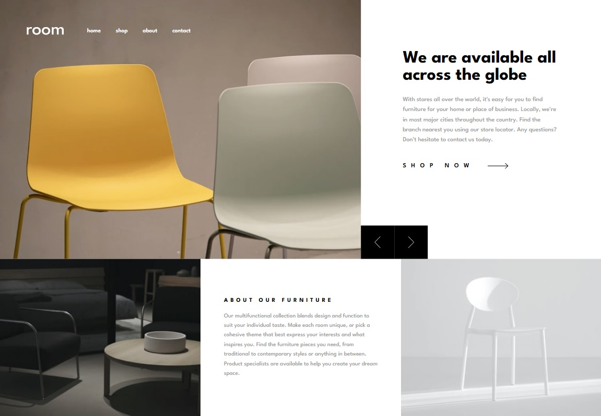

# Frontend Mentor - Room Homepage

Esta es una solución al [desafío Room homepage de Frontend Mentor](https://www.frontendmentor.io/challenges/room-homepage-BtdBY_ENq). Los desafíos de Frontend Mentor ayudan a mejorar las habilidades de programación mediante la construcción de proyectos realistas.

## Tabla de contenidos

- [Descripción general](#descripción-general)
  - [El desafío](#el-desafío)
  - [Captura de pantalla](#captura-de-pantalla)
  - [Enlaces](#enlaces)
- [Mi proceso](#mi-proceso)
  - [Construido con](#construido-con)
  - [Lo que aprendí](#lo-que-aprendí)
  - [Características destacadas](#características-destacadas)
- [Instalación y uso](#instalación-y-uso)
- [Autor](#autor)

## Descripción general

### El desafío

Los usuarios deben poder:

- Ver el diseño óptimo del sitio según el tamaño de pantalla de su dispositivo
- Ver estados hover en todos los elementos interactivos de la página
- Navegar por el slider usando mouse/trackpad o teclado (flechas ← →)
- Cerrar el menú móvil con la tecla ESC
- Experimentar una navegación completamente accesible por teclado
- Usar lectores de pantalla con soporte ARIA completo

### Captura de pantalla



### Enlaces

- URL de la solución: [Frontend Mentor](https://www.frontendmentor.io/solutions/room-homepage-with-react-q0mahyuhql)
- URL del sitio en vivo: [Demo](https://gilded-trifle-be57e2.netlify.app/)

## Mi proceso

### Construido con

- **Marcado semántico HTML5**
- **Propiedades personalizadas CSS** (variables CSS)
- **Flexbox** y **CSS Grid**
- **Flujo de trabajo Mobile-first**
- **[React](https://reactjs.org/)** v19.1.1 - Biblioteca JS
- **[Vite](https://vitejs.dev/)** v7.1.7 - Herramienta de construcción
- **Arquitectura Atomic Design** - Organización de componentes
- **WCAG 2.1 AA** - Estándares de accesibilidad

### Lo que aprendí

Este proyecto me permitió profundizar en varios aspectos importantes del desarrollo web moderno:

#### 1. Arquitectura Atomic Design
Implementé una estructura de componentes siguiendo la metodología Atomic Design:

```
src/components/
├── atoms/       (Button, Icon, Logo, NavLink)
├── molecules/   (Navigation, SliderControls)
├── organisms/   (Header, HeroSlider, AboutSection)
├── pages/       (HomePage)
└── templates/   (MainTemplate)
```

#### 2. Accesibilidad Web (WCAG 2.1 AA)
Implementé características de accesibilidad completas:

```jsx
// Navegación por teclado en el slider
useEffect(() => {
  const handleKeyDown = (e) => {
    if (e.key === 'ArrowLeft') prevSlide();
    else if (e.key === 'ArrowRight') nextSlide();
  };
  document.addEventListener('keydown', handleKeyDown);
  return () => document.removeEventListener('keydown', handleKeyDown);
}, []);
```

```jsx
// ARIA live regions para lectores de pantalla
<div aria-live="polite" aria-atomic="true">
  Slide {currentSlide + 1} of {slides.length}
</div>
```

#### 3. Estilos de foco accesibles
Implementé estilos `:focus-visible` en todos los elementos interactivos:

```css
.btn:focus-visible {
  outline: 2px solid var(--color-black);
  outline-offset: 4px;
}
```

### Características destacadas

✅ **Diseño responsive** - Mobile-first con breakpoints en 768px, 1024px y 1440px  
✅ **Slider funcional** - Con controles táctiles y de teclado  
✅ **Menú móvil** - Con overlay, animaciones y cierre con ESC  
✅ **Accesibilidad completa** - ARIA labels, roles, live regions  
✅ **Navegación por teclado** - Focus visible en todos los elementos interactivos  
✅ **Imágenes responsive** - Uso de `<picture>` para diferentes resoluciones  
✅ **Prevención de scroll** - Cuando el menú móvil está abierto  
✅ **Semántica HTML** - Uso correcto de etiquetas semánticas

## Instalación y uso

### Requisitos previos
- Node.js (v16 o superior)
- npm o yarn

### Instalación

```bash
# Clonar el repositorio
git clone https://github.com/tu-usuario/room-homepage.git

# Navegar al directorio
cd room-homepage

# Instalar dependencias
npm install
```

### Comandos disponibles

```bash
# Iniciar servidor de desarrollo
npm run dev

# Construir para producción
npm run build

# Previsualizar build de producción
npm run preview

# Ejecutar linter
npm run lint
```

## Autor

- Frontend Mentor - [@Oliver-92](https://www.frontendmentor.io/profile/Oliver-92)
- GitHub - [@Oliver-92](https://github.com/Oliver-92)
